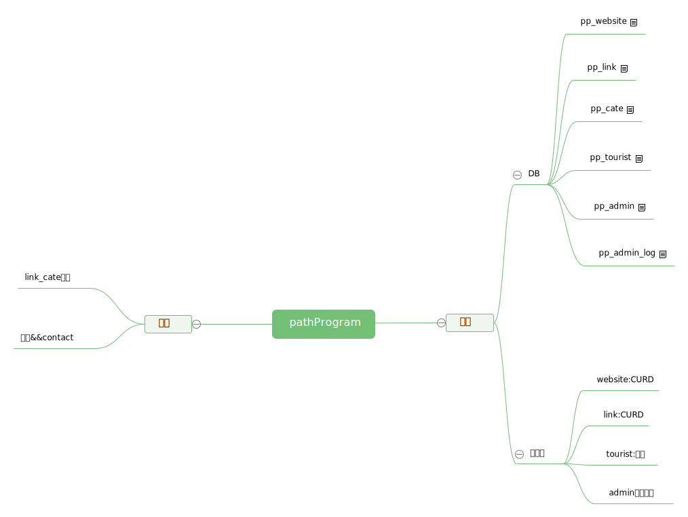

# pathProgram #
	A simple background management system based on CI3
	
	一个基于CI3的简单后台管理系统

----------

CI用法参考：

>[CI官方文档](http://codeigniter.org.cn/user_guide/index.html "CI用户文档") 

>[百度经验](https://jingyan.baidu.com/article/20095761ddd27ecb0721b42a.html "百度经验")

>[开源中国](https://my.oschina.net/rain21/blog/505771 "开源中国")

## 项目结构脑图： ##

